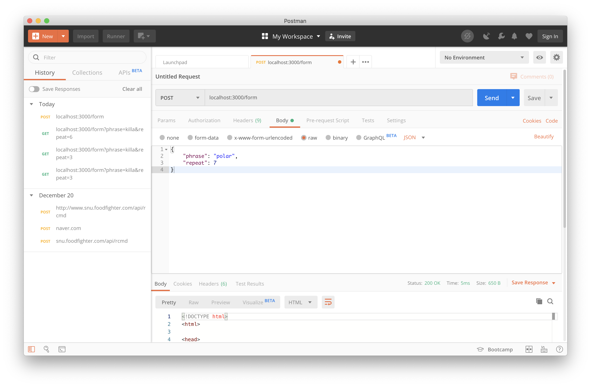
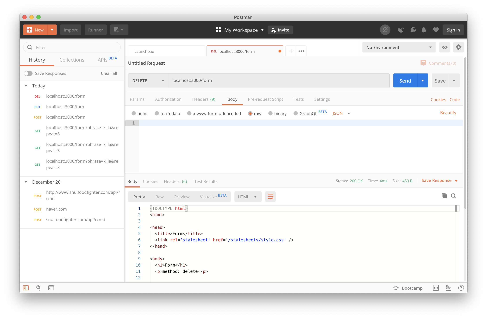

## WaaS Express 과제

### 12월 23일
* todo list의 제목을 "HelloTODO"로 하기 위해서는 localhost:3000/todo?title=HelloTODO 로 접근해야 함

### 12월 24일
#### GET

#### POST

#### PUT

#### DELETE


#### 12월 25일: HTTP Header, File Type

text 선택 후 
http://localhost:3000/mime/homework?image=y로 보낸다


#### 12월 26, 27일: login 구현체

waas로 로그인하니 쿠키 생성이 확인된다.


다 하기 전에는 캡쳐를 깜빡하고 안해놔서 완성본이다.
```
14-18: ukth계정 추가
   19: redirect ./login/isLogin으로 변경
28-37: undefined, waas, 이외계정 3가지로 나누어 응답 설정
```

이상한 계정으로 로그인 시도하니


unauthorized 잘 뜬다


내 계정은


forbidden 뜬다.


waas 계정은


잘 뜬다(계정 저장옵션까지 뜬다 굳)

